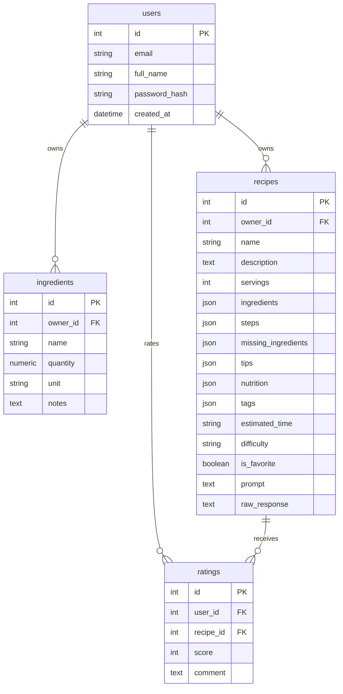

# Generador de Recetas con Inventario

Aplicacion web del proyecto final de Tecnologias Web. Permite registrar ingredientes disponibles en casa, generar recetas estructuradas con un LLM y guardar el historial con calificaciones, favoritos, filtros y resumen del inventario.

## Integrantes

- Sean Paul Marquez Toro
- Reyner David Barbosa de la Rosa
- Ruben Andres Corro Blanco

## Stack

- Python 3.12 + FastAPI
- SQLAlchemy + PostgreSQL
- OpenRouter como proveedor LLM
- HTML, CSS y JavaScript vanilla para una interfaz tipo dashboard
- Docker Compose con servicios separados: `app`, `db` y `caddy`
- Caddy para HTTPS automatico con dominio propio

## Funcionalidades

- Registro e inicio de sesion con token JWT.
- CRUD de ingredientes por usuario.
- Dashboard con score automatico del inventario y sugerencias de mejora.
- Cabecera visual y fotografias generadas para dar contexto culinario al producto.
- Recomendaciones automaticas de recetas calculadas desde el inventario, con porcentaje de compatibilidad.
- Catalogo de recomendaciones basado en productos comunes de canasta familiar colombiana: arroz, papa, yuca, platano, granos, carnes, lacteos, verduras, frutas, avena, pan, arepa y mas.
- Botones rapidos para agregar productos de canasta familiar al inventario.
- Desglose de ingredientes por receta: disponibles, faltantes, opcionales y basicos asumidos.
- Boton para generar una receta completa a partir de una recomendacion especifica.
- Generacion de recetas desde inventario con preferencias: porciones, tipo de comida, objetivo, estilo, tiempo maximo, restricciones e instrucciones extra.
- Respuesta LLM enriquecida: descripcion, ingredientes, pasos, faltantes, consejos, nutricion estimada y etiquetas.
- Historial de recetas generadas con busqueda.
- Marcado de recetas favoritas y filtro de favoritas.
- Calificacion de recetas de 1 a 5 estrellas.
- Eliminacion de recetas del historial.
- Copia de recetas al portapapeles para compartir o entregar.
- Swagger/OpenAPI automatico en `/docs`.

## Configuracion local

1. Copia las variables de entorno:

```bash
cp .env.example .env
```

2. Edita `.env` y define al menos `SECRET_KEY`. Para usar LLM real, define `OPENROUTER_API_KEY`.

3. Ejecuta con Docker Compose:

```bash
docker compose up --build
```

4. Abre la aplicacion:

- App: `http://localhost`
- API docs: `http://localhost/docs`

Para desarrollo sin Docker se puede usar SQLite por defecto:

```bash
python3 -m venv .venv
source .venv/bin/activate
pip install -r requirements.txt
LLM_DRY_RUN=true uvicorn app.main:app --reload
```

## Variables de entorno

| Variable | Uso |
| --- | --- |
| `DATABASE_URL` | URL SQLAlchemy de la base de datos. En Compose se construye con Postgres. |
| `SECRET_KEY` | Llave usada para firmar JWT. No debe subirse al repositorio. |
| `OPENROUTER_API_KEY` | API key del proveedor LLM. No debe subirse al repositorio. |
| `OPENROUTER_MODEL` | Modelo usado para generar recetas. |
| `LLM_DRY_RUN` | Si es `true`, genera una receta deterministica para pruebas locales. |
| `DOMAIN` | Dominio que Caddy usara para emitir SSL en produccion. |

## Pruebas

```bash
pytest
```

Las pruebas cubren validacion de ingredientes, generacion del prompt, parseo de respuesta del LLM, render de la pagina principal, autenticacion, generacion de recetas, calificaciones, favoritos, resumen del inventario y recomendaciones con desglose/canasta familiar.

## Despliegue en VPS

1. Apunta el dominio al servidor con registros DNS `A` y/o `AAAA`.
2. Instala Docker y Docker Compose en el VPS.
3. Clona el repositorio.
4. Crea `.env` desde `.env.example` y cambia `DOMAIN`, `SECRET_KEY`, `POSTGRES_PASSWORD` y `OPENROUTER_API_KEY`.
5. Ejecuta:

```bash
docker compose up --build -d
```

Caddy solicitara automaticamente el certificado SSL de Let's Encrypt cuando el dominio resuelva al VPS.

## Modelo de datos



## Entregables

- Repositorio publico: https://github.com/rubencorrob-sudo/generador-recetas-inventario
- Aplicacion en produccion con HTTPS: https://recetasruben.duckdns.org
- Swagger/OpenAPI: https://recetasruben.duckdns.org/docs
- PDF de maximo 3 paginas: `docs/informe-proyecto-recetas.pdf`

## Notas para la sustentacion

- El servicio LLM esta encapsulado en `app/services/llm_service.py`; el usuario nunca conversa libremente con el modelo.
- El prompt fuerza JSON estructurado y guarda el prompt/respuesta cruda para trazabilidad tecnica.
- El sistema recomienda recetas sin llamar al LLM, usando un motor local de compatibilidad contra el inventario.
- La interfaz muestra metricas, score de inventario, preferencias del generador, nutricion estimada y favoritos.
- Los assets visuales de la app estan en `static/images/` y las capturas de sustentacion en `docs/screenshots/`.
- No hay credenciales reales en el repositorio. Usa `.env` en local/produccion.
- Cada integrante debe registrar al menos 10 commits descriptivos para evitar penalizacion individual.
