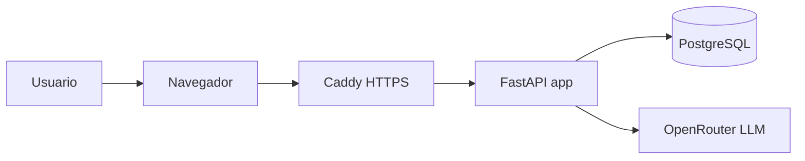
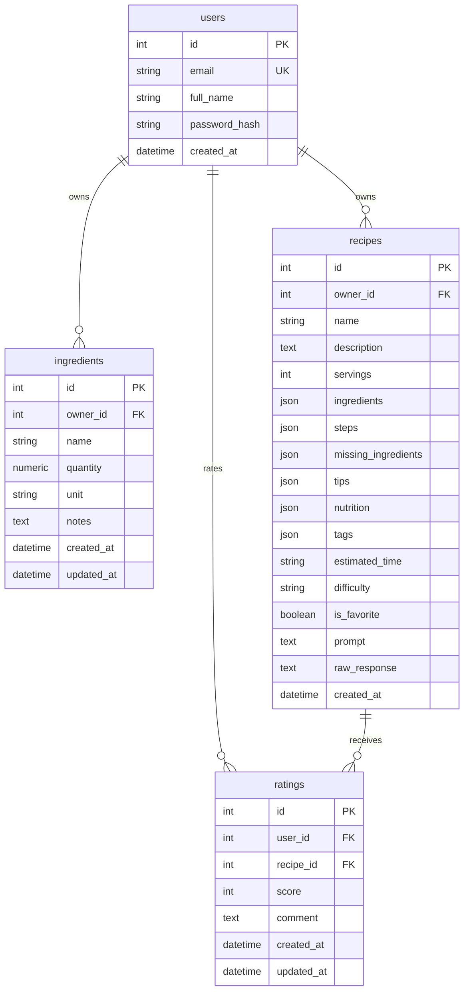

# Informe del proyecto: Generador de Recetas con Inventario

## Integrantes

- Sean Paul Marquez Toro
- Reyner David Barbosa de la Rosa
- Ruben Andres Corro Blanco

## Entregables

- Repositorio publico: https://github.com/rubencorrob-sudo/generador-recetas-inventario
- Aplicacion en produccion con HTTPS: https://54-236-36-56.sslip.io
- Swagger/OpenAPI: https://54-236-36-56.sslip.io/docs
- Dominio alterno DuckDNS: https://recetasruben.duckdns.org
- PDF de entrega: `docs/informe-proyecto-recetas.pdf`

## Arquitectura

La aplicacion usa una arquitectura monolitica modular con FastAPI. El frontend se sirve desde el mismo backend mediante Jinja2, CSS y JavaScript vanilla, con una experiencia tipo dashboard y assets fotograficos propios. El navegador consume la API REST con JWT en el encabezado `Authorization`.

En produccion, Docker Compose levanta tres servicios:

- `caddy`: proxy inverso y SSL automatico con Let's Encrypt.
- `app`: FastAPI + Uvicorn, responsable de autenticacion, inventario, recetas y consumo del LLM.
- `db`: PostgreSQL, responsable de persistencia.

El servicio de LLM esta encapsulado en `app/services/llm_service.py`. La interfaz no expone un chatbot; envia inventario y preferencias culinarias al endpoint interno `POST /api/recipes/generate`, que guarda prompt, respuesta cruda y receta estructurada. Adicionalmente, `app/services/recommendation_service.py` calcula recomendaciones y desglose de ingredientes sin depender del proveedor LLM.

## Diagrama de contenedores



## Diagrama ER



## Decisiones tecnicas

- JWT se firma con HS256 y `SECRET_KEY`; las contrasenas se almacenan con PBKDF2 y sal unica.
- SQLAlchemy 2 mantiene los modelos de dominio y permite usar SQLite en pruebas y PostgreSQL en produccion.
- El prompt obliga al modelo a responder solo JSON con las claves pedidas por el enunciado y campos extra para una entrega mas completa: descripcion, faltantes, consejos, nutricion y etiquetas.
- El parser del LLM acepta JSON plano o bloques ```json y valida la estructura con Pydantic.
- El dashboard calcula un score de inventario y sugerencias de mejora sin depender del LLM.
- El motor local de recomendaciones calcula compatibilidad, ingredientes disponibles, faltantes, opcionales y basicos asumidos.
- El catalogo local cubre productos comunes de canasta familiar colombiana y permite mostrar multiples opciones aunque falten algunos ingredientes.
- Los assets visuales se sirven desde `static/images/` para mejorar la presentacion sin depender de servicios externos.
- Las variables sensibles se cargan desde `.env`; `.env.example` documenta la configuracion sin exponer secretos.

## Capturas sugeridas

Incluir en el PDF final:

- Pantalla de registro/inicio de sesion.
- Dashboard con metricas, inventario y preferencias del generador.
- Historial con una receta generada, calificada y marcada como favorita.
- Seccion de recomendaciones con desglose de ingredientes.
- Botones rapidos para cargar inventario desde productos frecuentes de canasta.
- Swagger en `/docs` como evidencia de endpoints documentados.
